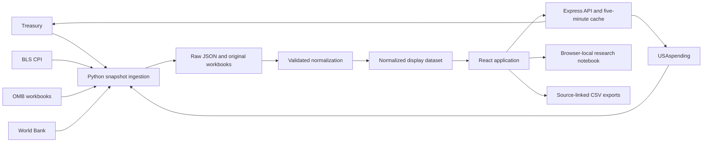

# Data architecture and accounting rules

## Running system

No credentials are needed for the implemented providers. External API base URLs are fixed in the backend. Search inputs are length- and type-checked, date ranges are validated, requests time out, and the cache is bounded. Clients cannot turn the backend into an arbitrary-URL proxy.

## Treasury normalization

MTS Table 1 contains both the reported fiscal year and prior-year comparisons. `record_fiscal_year` alone does not identify a row's economic year. The normalizer resolves each data row's `parent_id` to the relevant `FY YYYY` header's `classification_id`.

Annual totals use `Year-to-Date` rows in September statements. Monthly data for a completed year use the same publication vintage as that year's chosen annual total. This avoids joining revised months from a later statement to an unrevised annual total. Tests require all 12 monthly spending and revenue observations to sum within one dollar of their respective annual totals.

The department comparison reads the specified FY 2025 September Table 5, uses net outlays, and selects department total rows and the Social Security Administration at the source hierarchy level. The displayed composition bar covers the selected departments only; it is not labeled as a complete decomposition of the federal budget. Treasury department totals include transfers, interest, benefits, and other non-contract activity.

Historical debt retains original records and dates. The display series selects the later observation when the source has multiple records for one year. This affects 1843. The annual chart does not pretend the fiscal calendar has always ended September 30.

## USAspending normalization

Search supports contracts, grants, direct payments, other assistance and loans. Combined non-loan award search federates four source queries, up to 50 rows per group; it is not a global ranking. Loan face value and subsidy cost are distinct fields. Date filtering selects awards with activity in the period, while the `Award Amount` output is a lifetime award measure. State geography uses period net obligations and place of performance.

The primary public award key is `generated_internal_id`; numeric internal IDs are retained but do not define the research identity. The initial response contained two rows for the same Pfizer award with different numeric internal IDs. The canonical identifier and reported lifetime amount were identical. The raw response is retained, while the displayed snapshot and backend result page collapse repeated canonical identifiers to prevent double counting.

Connection summaries are computed only over loaded records. Reported UEIs are used when present. An exact-name fallback is explicitly weaker than a verified entity match. No parent-company or beneficial-ownership inference is made.

Award detail fields come from `latest_transaction_contract_data`. They describe the latest reported contract transaction rather than a complete amendment history. The single-offer notice only reports the observable condition and requests corroboration.

## CPI, GDP, and historical budget data

CPI series CUUR0000SA0 is monthly, all-items CPI-U, not seasonally adjusted. Only valid numeric months are retained. Annual averages require 12 observations; unavailable values are not forward-filled. Annual inflation adjustment is `nominal × CPI(target) / CPI(observation)`. Year-over-year monthly inflation compares the same month in consecutive years.

The current CPI source omits October 2025. Consequently, the annual calculator and complete-year adjustments stop at 2024. The latest valid monthly observation is still used for monthly inflation. Labels distinguish these frequencies.

OMB Table 1.1 is in millions of dollars; Table 14.2 is in billions. The workbook parser reads cached values from the original XLSX ZIP/XML with Python's standard library. It excludes grouped early periods, the 1976 transition quarter, notes, and non-year rows. Only actual annual rows through 2025 are displayed. Pre-1933 figures use the historical administrative-budget concept; later years use the unified-budget concept.

OMB Table 14.2 combines federal outlays with state/local expenditures from own sources on a NIPA basis, net of interest receipts. Federal grants are reported as an addendum. They are not added again to the combined total. The source mixes accounting conventions intentionally; it should not be used as an exact reconciliation of every local government's cash book.

GDP and population use World Bank annual U.S. observations. A missing denominator means the year is omitted from the contextual series. Calendar-year denominators do not become fiscal-year denominators through relabeling.

## Provenance and operations

Raw JSON snapshots carry source URLs and retrieval timestamps. OMB originals are retained and their publication is pinned. Live search labels record submitted dates, state, agency, and keywords. CSV exports include source and measure definitions. Saved awards retain their source identity in local storage; they do not claim to be refreshed valuations.

Refresh writes are atomic per source, not transactional across all sources. The command exits nonzero on any provider failure. Run normalization and build only after a successful complete refresh. For a larger deployment, use immutable snapshot directories plus a validated manifest pointer to make publication transactional across sources.

Debt, award-detail, award searches, aggregate queries, and nonprofit responses use bounded five-minute caches. Historical series and live interfaces are shared by HTTP and MCP. The server's cache is process-local and lost on restart. There is no shared rate limiter or distributed cache in this release. Production traffic growth should trigger a shared cache, measured provider-specific rate budgets, retry policies, and monitored refresh jobs.

## Expanded fiscal and investigative sources

OMB Tables 2.1, 3.1, and 4.1 provide annual receipts by source, spending by function, and spending by agency. Original workbooks are retained. Source dots signify no amount and are normalized to zero; unknown response fields and failed fetches are not. Category rounding tolerances are tested against reported totals. Negative categories remain signed. Agency and function classifications are alternate views of the same net outlays. The later OMB publication vintage can revise Treasury MTS values; the UI explains the difference.

The funding atlas uses transaction-level aggregates from USAspending, with source filters preserved in snapshots. Geography explicitly requests primary place of performance. Overseas amounts are not labeled foreign aid. The program and recipient rankings are source-paginated; their first 100 rows do not define the universe. Prime/subaward funding is never added together.

Nonprofit data comes from IRS records through ProPublica Nonprofit Explorer. EINs retain leading zeroes and are not equated to UEIs. Fiscal periods and filing links are retained. Officer and inter-nonprofit grant networks are not automatically constructed from name similarities. See the agent guide for live API inputs.
